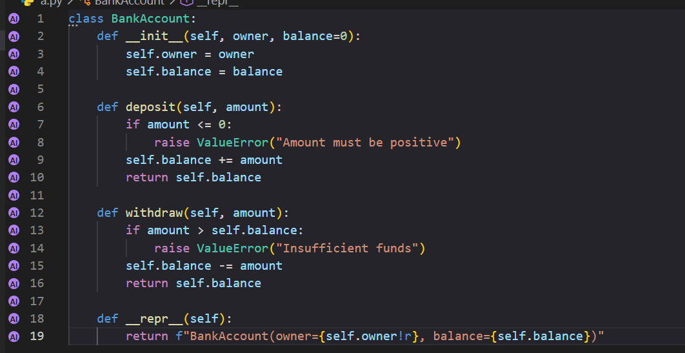
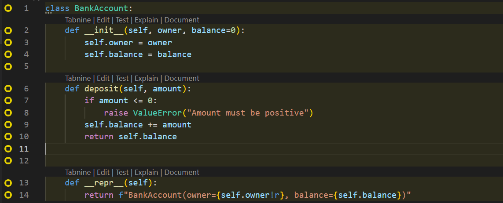

<p align="center">
  
</p>

<h1 align="center">codeprov — Code Provenance Guard</h1>

<p align="center">
  Surfaces AI-like or pasted code that has not been explicitly reviewed.<br/>
  <strong>Local-first. No API keys required. No code leaves your machine.</strong>
</p>

Linters tell you when code quality is poor. CI tells you when a test fails.

But neither tells you:

> “You never reviewed these 23 lines.”

**codeprov** is a VS Code extension that tracks how code enters a file—typed manually, pasted from the clipboard, or inserted by an external tool—and highlights external code that has not been explicitly reviewed.

> [!NOTE]
> AI-origin detection is heuristic. A large insertion that does not match the current clipboard is classified as `ai`, but formatters, snippets, refactoring tools, and other extensions may produce similar events.

## Features

- **Origin tracking** — classifies code blocks as `typed`, `pasted`, or `ai`.
- **Unread markers** — highlights large external code blocks in the editor gutter.
- **Explicit review flow** — blocks remain unread until marked as reviewed.
- **Sensitive-file awareness** — assigns higher risk to files such as authentication code, SQL files, environment files, and files containing secrets.
- **Manual commit check** — lists unread external blocks before you commit.
- **Post-commit warning** — warns after a commit if unread blocks still exist, giving you a chance to review them before pushing.
- **Session report** — displays typed, pasted, AI-like, and unread code statistics.
- **Off-screen detection** — detects supported code files modified by external tools while they are not open in the editor.
- **Local-first design** — provenance and review state are processed locally and kept in memory.

## Repository layout

```text
WASM/
├── extension/   # TypeScript VS Code extension
├── engine/      # Optional Rust → WASM provenance engine
├── docs/        # Provenance and scoring documentation
└── tests/       # Test fixtures and integration tests
```

## Quick start

```bash
git clone https://github.com/AlbayEmre/WASM.git
cd WASM/extension
npm install
npm run compile
```

Open the project in VS Code and press `F5` to launch an **Extension Development Host**.

Then:

1. Open a source-code file.
2. Paste at least 3 lines or 80 characters.
3. The inserted block appears as unread in the gutter and status bar.
4. Place the cursor inside the highlighted block.
5. Press `Ctrl+.` and select **codeprov: Mark this block as reviewed**.
6. Run **codeprov: Check unread AI/pasted code** from the Command Palette before committing.

You can also use:

- **codeprov: Mark current file as reviewed**
- **codeprov: Show provenance report**
- **codeprov: Export rules**
- **codeprov: Import rules**

See [`extension/README.md`](extension/README.md) for the complete feature list and [`docs/provenance-model.md`](docs/provenance-model.md) for the scoring model.

## Screenshots

Gutter markers show the detected origin of unread external code:

<p align="center">
  
  
</p>

## Origin detection

VS Code does not always expose whether a text insertion came from a clipboard paste, an inline AI suggestion, a snippet, or another extension.

codeprov therefore uses a local heuristic:

| Change | Classification |
|---|---|
| Small insertion below the configured thresholds | `typed` |
| Large insertion matching the current clipboard | `pasted` |
| Large insertion not matching the current clipboard | `ai` |

The default thresholds are:

- 3 inserted lines
- 80 inserted characters

These values can be changed in the VS Code settings.

The `ai` classification should be understood as **AI-like or externally inserted code**, not cryptographic proof that a specific AI tool generated it.

## Review workflow

New external blocks remain unread until they are explicitly reviewed.

To mark a block as reviewed:

1. Place the cursor inside the highlighted block.
2. Press `Ctrl+.`.
3. Select **codeprov: Mark this block as reviewed**.

Opening a file, scrolling through it, or moving the cursor over a block does not automatically mark it as reviewed.

This explicit action prevents accidental cursor movement from being interpreted as proof of review.

## Commit checks

codeprov provides two commit-related controls.

### Manual pre-commit check

Run the following command before committing:

```text
codeprov: Check unread AI/pasted code
```

It lists files containing unread external blocks and highlights sensitive files.

This command does not automatically block Git commits. It is a review command that must currently be executed manually.

### Post-commit warning

codeprov monitors the Git HEAD revision. If a commit is completed while unread external blocks remain, it displays a warning so the code can be reviewed before pushing.

## Sensitive files

Unread external blocks receive a higher risk score when their paths match configured sensitive patterns.

Default patterns include:

```text
**/auth/**
**/*secret*
**/*.sql
**/*.env
```

The patterns can be customized using the `codeprov.sensitivePaths` setting.

## TypeScript and Rust/WASM engines

The extension includes a complete **TypeScript engine** that runs without requiring a Rust toolchain.

The repository also contains an optional **Rust → WASM engine** implementing the same core origin classification and risk-scoring approach.

Build the WASM engine with:

```bash
cd engine
rustup target add wasm32-unknown-unknown
cargo install wasm-pack
./build.sh
```

The output is written to:

```text
extension/wasm
```

If the WASM artifact is unavailable, the extension automatically falls back to the TypeScript engine.

## Configuration

| Setting | Default | Description |
|---|---:|---|
| `codeprov.enabled` | `true` | Enables provenance tracking |
| `codeprov.minScore` | `0.5` | Minimum risk score displayed |
| `codeprov.pasteThresholdLines` | `3` | Minimum lines for an external insertion |
| `codeprov.pasteThresholdChars` | `80` | Minimum characters for an external insertion |
| `codeprov.blockCommitOnUnreadSensitive` | `true` | Shows a stronger modal warning for sensitive files |
| `codeprov.sensitivePaths` | predefined patterns | Paths treated as sensitive |
| `codeprov.ignorePaths` | build/dependency folders | Paths excluded from tracking |
| `codeprov.alert.slackWebhook` | empty | Optional Slack incoming-webhook URL |

## Privacy

Provenance data, code blocks, paths, and review state are processed locally.

- No API key is required.
- No AI model or external classification service is used.
- No source code or file contents are uploaded.
- Tracking data is session-scoped and stored in memory.

The optional Slack summary is disabled by default. When explicitly configured and manually triggered, it sends aggregate counts and ratios through the supplied webhook. It does not send source code or file contents.

## Current limitations

- AI-origin detection is heuristic and may produce false positives.
- Formatters, snippets, refactoring tools, and agent-written files may be classified as AI-like external code.
- Review state is currently session-scoped and is not persisted between VS Code sessions.
- Commit checking is manual; codeprov does not currently install or enforce a Git pre-commit hook.
- Full VS Code editor-host tests are planned.

## Development

Compile the extension:

```bash
cd extension
npm install
npm run compile
```

Run Rust integration tests:

```bash
cd engine
cargo test
```

Build the VS Code extension package:

```bash
cd extension
npm run vsce:package
```

## Contributing

Issues, feature requests, and pull requests are welcome.

If you find a false positive or have an idea for improving provenance detection, please open an issue with a reproducible example.

## License

MIT

## Links

- [GitHub repository](https://github.com/AlbayEmre/WASM)
- [VS Code Marketplace](https://marketplace.visualstudio.com/items?itemName=yunus-emre-albayrak.codeprov)
